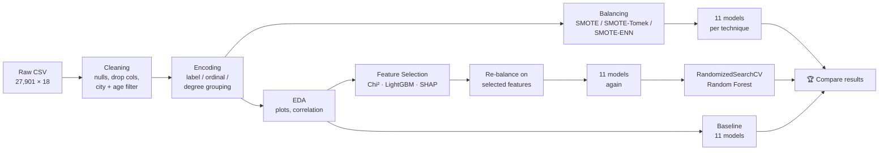

# 🧠 Student Depression Prediction

> **Can we predict whether a student is depressed from their academic, lifestyle and personal factors?**
> This project cleans a survey dataset of ~28,000 students, tests **11 ML classifiers** under **7 different data-balancing / feature-selection setups**, and explains the results with **Chi-Square, LightGBM importance and SHAP**.

   

---

## ⚡ TL;DR (read this if you read nothing else)

| | |
|---|---|
| **Goal** | Predict `Depression` (0 = No, 1 = Yes) for a student |
| **Data** | 27,901 students × 18 columns → **21,780 × 14** after cleaning |
| **Problem found** | Classes are imbalanced: **63.5 % depressed / 36.5 % not** (after cleaning) |
| **What was tried** | 11 models × 7 setups (no balancing, SMOTE, SMOTE-Tomek, SMOTE-ENN, each with and without feature selection) |
| **Baseline (no balancing)** | ≈ **85 %** accuracy (best: SVM 84.96 %) |
| **Best realistic result** | ≈ **89 %** accuracy, 0.89 F1 → **Feature-selected + SMOTE-Tomek** (CatBoost 89.17 %, Random Forest 89.10 %) |
| **Highest raw score** | ≈ **97 %** with SMOTE-ENN, but treat with caution (see [Caveats](#-caveats--honest-notes)) |
| **Top drivers of depression** | Suicidal thoughts, Academic Pressure, Financial Stress, Work/Study Hours, Diet |
| **Not important** | Gender, Degree level, CGPA, City |

---

## 📑 Table of Contents

1. [Project Overview](#-project-overview)
2. [Dataset](#-dataset)
3. [Workflow at a Glance](#-workflow-at-a-glance)
4. [Data Cleaning & Preprocessing](#-data-cleaning--preprocessing)
5. [Exploratory Data Analysis – Key Findings](#-exploratory-data-analysis--key-findings)
6. [Handling Class Imbalance](#-handling-class-imbalance)
7. [Models & Evaluation Method](#-models--evaluation-method)
8. [Feature Selection](#-feature-selection)
9. [Results](#-results)
10. [Hyperparameter Tuning](#-hyperparameter-tuning)
11. [Key Insights](#-key-insights)
12. [Caveats & Honest Notes](#-caveats--honest-notes)
13. [How to Run](#-how-to-run)
14. [Repository Structure](#-repository-structure)
15. [Future Work](#-future-work)
16. [Disclaimer](#-disclaimer)

---

## 🎯 Project Overview

Mental health among students is a growing concern. This project builds a **binary classification pipeline** that predicts whether a student is likely to be depressed, and, just as importantly, **which factors matter most**.

**What makes this project more than "fit a model":**

- 🧹 Careful cleaning (removing near-empty columns, junk city names, outlier ages)
- ⚖️ A systematic comparison of **3 resampling techniques** to fix class imbalance
- 🔍 **3 independent feature-selection views** (Chi-Square, LightGBM gain/split, SHAP)
- 🏁 A **leaderboard of 11 models** evaluated with 8 metrics
- 🎛️ Hyperparameter tuning with `RandomizedSearchCV`

---

## 📂 Dataset

**File expected by the notebook:** `Student Depression Dataset.csv` (place it next to the notebook; it is **not** included in the zip).

| Property | Value |
|---|---|
| Raw size | 27,901 rows × 18 columns |
| Missing values | Only 3 (in `Financial Stress`) |
| Target | `Depression` → 58.5 % Yes / 41.5 % No (raw data) |
| Coverage | Students across 30 major Indian cities |

### Column dictionary

| Column | Type | Description | Used in model? |
|---|---|---|---|
| `id` | int | Row identifier | ❌ Dropped |
| `Gender` | categorical | Male / Female | ✅ (later removed by feature selection) |
| `Age` | numeric | 18 – 59 in raw data; kept ≤ 30 | ✅ |
| `City` | categorical | City of residence | ✅ |
| `Profession` | categorical | 99.9 % are "Student" | ❌ Dropped (no signal) |
| `Academic Pressure` | ordinal 0–5 | Self-reported pressure from studies | ✅ |
| `Work Pressure` | ordinal | Almost always 0 (mean ≈ 0.0004) | ❌ Dropped |
| `CGPA` | numeric | Academic score | ✅ |
| `Study Satisfaction` | ordinal 0–5 | Satisfaction with studies | ✅ |
| `Job Satisfaction` | ordinal | Almost always 0 (mean ≈ 0.0007) | ❌ Dropped |
| `Sleep Duration` | categorical | <5h, 5-6h, 7-8h, >8h, Others | ✅ |
| `Dietary Habits` | categorical | Healthy / Moderate / Unhealthy / Others | ✅ |
| `Degree` | categorical | 28 different degrees | ✅ Regrouped → `New_Degree` |
| `Have you ever had suicidal thoughts ?` | binary | Yes / No | ✅ |
| `Work/Study Hours` | numeric | Daily hours | ✅ |
| `Financial Stress` | ordinal 1–5 | Self-reported financial stress | ✅ |
| `Family History of Mental Illness` | binary | Yes / No | ✅ (later removed by feature selection) |
| **`Depression`** | **binary** | **🎯 Target (1 = depressed)** | **Target** |

---

## 🗺️ Workflow at a Glance



---

## 🧹 Data Cleaning & Preprocessing

| # | Step | Detail | Why |
|---|---|---|---|
| 1 | **Fill missing values** | 3 null `Financial Stress` values → filled with the **mode (5.0)** | Ordinal feature; mode keeps the scale valid |
| 2 | **Drop useless columns** | `id`, `Profession`, `Work Pressure`, `Job Satisfaction` | Identifier, or almost constant, so no predictive value |
| 3 | **Remove rare cities** | Dropped cities with **< 400** records (this also removed junk entries such as names typed into the City field) → **30 cities** remain | Noise and sparse categories |
| 4 | **Restrict age** | Kept students **aged ≤ 30** | Removes sparse older-age outliers; the population is mostly 18–30 |
| 5 | **Encode categoricals** | See table below | Models need numbers |
| 6 | **Regroup `Degree`** | 28 degrees → 4 groups (see below) | Reduces cardinality, keeps education level |

### Encoding scheme

| Feature | Encoding |
|---|---|
| `Gender` | Female = 0, Male = 1 |
| `City` | LabelEncoder (30 cities → 0–29) |
| `Sleep Duration` | Less than 5 h = 0, 5-6 h = 1, 7-8 h = 2, More than 8 h = 3, Others = 4 |
| `Dietary Habits` | Unhealthy = 0, Moderate = 1, Healthy = 2, Others = 3 |
| Suicidal thoughts / Family history | No = 0, Yes = 1 |

### Degree grouping → `New_Degree`

| Code | Group | Includes |
|---|---|---|
| 0 | Graduated | BSc, BCA, B.Ed, BHM, B.Pharm, B.Com, BE, BA, B.Arch, B.Tech, BBA, LLB |
| 1 | Post Graduated | MSc, MCA, M.Ed, M.Pharm, M.Com, ME, MA, M.Tech, MBA, LLM |
| 2 | Higher Secondary | Class 12 |
| 3 | Others | MBBS, MD, PhD, MHM, Others |

### Final modelling dataset

| | Before | After |
|---|---|---|
| Rows | 27,901 | **21,780** |
| Columns | 18 | **14** (13 features + target) |
| Depressed (1) | 16,336 (58.5 %) | **13,828 (63.5 %)** |
| Not depressed (0) | 11,565 (41.5 %) | **7,952 (36.5 %)** |

---

## 📊 Exploratory Data Analysis – Key Findings

| # | Finding | Evidence |
|---|---|---|
| 1 | **More male students than female** in the survey | 15,547 male vs 12,354 female |
| 2 | **Depression rate is almost identical across genders** | Male ≈ 58.6 % vs Female ≈ 58.5 % → gender is not a real driver |
| 3 | **Most students are young** | Mean age ≈ 25.8 (raw), ≈ 23.9 after filtering; depressed students are slightly younger (mean 24.9) |
| 4 | **Class 12 is the largest education group** | 6,080 students |
| 5 | **Short sleep = higher depression rate** | < 5 h → **64.5 %**, 7-8 h → 59.5 %, 5-6 h → 56.9 %, > 8 h → **50.9 %** |
| 6 | **Academic pressure is skewed high** | Mean ≈ 3.1 on a 0–5 scale; the 4–5 band is the single largest group |
| 7 | **Dataset is imbalanced** | ~63 / 37 split → motivates resampling |

### Correlation with `Depression` (from the heatmap)

| Feature | Correlation | Strength |
|---|---|---|
| Suicidal thoughts | **+0.54** | 🔴 Strong |
| Academic Pressure | **+0.47** | 🔴 Strong |
| Financial Stress | **+0.36** | 🟠 Moderate |
| Work/Study Hours | +0.21 | 🟡 Weak–moderate |
| Dietary Habits | −0.20 | 🟡 Weak–moderate (healthier diet → less depression) |
| Study Satisfaction | −0.16 | 🟡 Weak |
| Age | −0.14 | 🟡 Weak |
| Sleep Duration | −0.09 | ⚪ Very weak |
| Family History | +0.06 | ⚪ Very weak |
| CGPA, City, Gender | ≈ 0.01–0.02 | ⚪ None |

> Features are largely independent of each other (no heavy multicollinearity). The only notable pair is `Age` ↔ `New_Degree` (−0.42), which is expected.

---

## ⚖️ Handling Class Imbalance

Since the cleaned data is 63.5 / 36.5, three resampling strategies were compared:

| Technique | Idea | Resulting size | Class split (0 / 1) |
|---|---|---|---|
| **None (baseline)** | Use data as is | 21,780 | 7,952 / 13,828 |
| **SMOTE** | Oversample the minority class with synthetic points | 27,656 | 13,828 / 13,828 |
| **SMOTE-Tomek** | SMOTE + remove Tomek-link (borderline) pairs | 26,692 | 13,346 / 13,346 |
| **SMOTE-ENN** | SMOTE + remove samples misclassified by their neighbours (Edited Nearest Neighbours) | 16,917 | 9,487 / 7,430 |

---

## 🤖 Models & Evaluation Method

**11 classifiers** are trained and compared in every experiment:

| Family | Models |
|---|---|
| Linear | Logistic Regression |
| Kernel / distance | SVM (RBF), K-Nearest Neighbours (k = 3) |
| Tree | Decision Tree |
| Bagging | Random Forest |
| Boosting | AdaBoost, Gradient Boosting, HistGradientBoosting, XGBoost, LightGBM, CatBoost |

**Evaluation protocol (same for every experiment):**

- 80 / 20 train-test split (`random_state=0`)
- **10-fold cross-validation** on the training set (mean ± std)
- Metrics: Accuracy, K-Fold Mean Accuracy, Std Dev, ROC-AUC, Precision, Recall, F1, Cohen's Kappa
- Confusion matrix and ROC curves are plotted for each model
- A reusable `run_model()` helper returns a sorted leaderboard DataFrame

---

## 🔍 Feature Selection

Three different lenses were used to decide which features to keep:

| Method | Top features | Weakest features |
|---|---|---|
| **Chi-Square test** | Academic Pressure, Suicidal thoughts, Work/Study Hours, Financial Stress | Gender (p = 0.24), CGPA (p = 0.09) → *not significant* |
| **LightGBM importance** (gain & split) | Suicidal thoughts, Academic Pressure, Financial Stress | Gender, New_Degree, Family History |
| **SHAP** (summary plot) | Suicidal thoughts, Academic Pressure, Financial Stress, Dietary Habits, Work/Study Hours | Gender, New_Degree, City |

**Decision:** Drop **`Gender`, `New_Degree`, `Family History of Mental Illness`** → **10 features remain** (+ target).

`Age, City, Academic Pressure, CGPA, Study Satisfaction, Sleep Duration, Dietary Habits, Suicidal thoughts, Work/Study Hours, Financial Stress`

**SHAP directions (what it learned):**

| Higher value of… | Pushes prediction toward |
|---|---|
| Suicidal thoughts (Yes) | ⬆ Depressed |
| Academic Pressure | ⬆ Depressed |
| Financial Stress | ⬆ Depressed |
| Work/Study Hours | ⬆ Depressed |
| Dietary Habits (healthier) | ⬇ Not depressed |
| Study Satisfaction | ⬇ Not depressed |
| Age (older) | ⬇ Not depressed |

---

## 🏆 Results

### Best model in each experiment

| # | Experiment | Best model (by test accuracy) | Accuracy | K-Fold Acc. | ROC-AUC* | F1 | Kappa |
|---|---|---|---|---|---|---|---|
| 1 | Baseline (no balancing) | SVM | 84.96 % | 84.62 % | 0.828 | 0.884 | 0.670 |
| 2 | SMOTE | LightGBM | 87.92 % | 87.80 % | 0.879 | 0.881 | 0.759 |
| 3 | SMOTE-Tomek | LightGBM | 88.59 % | 88.70 % | 0.886 | 0.889 | 0.772 |
| 4 | SMOTE-ENN | KNN | 97.10 % | 96.62 % | 0.969 | 0.966 | 0.941 |
| 5 | Feature-selected + SMOTE | CatBoost | 87.69 % | 87.85 % | 0.877 | 0.879 | 0.754 |
| 6 | **Feature-selected + SMOTE-Tomek** | **CatBoost** | **89.17 %** | 88.51 % | **0.892** | **0.892** | **0.783** |
| 7 | Feature-selected + SMOTE-ENN | KNN | 97.00 % | 96.74 % | 0.968 | 0.966 | 0.939 |

<sub>*ROC-AUC in the notebook is computed from hard class predictions, not probabilities, so it behaves like balanced accuracy.</sub>

### Full leaderboard – Feature-selected + SMOTE-Tomek (the most balanced, realistic setup)

| Rank | Model | Accuracy | K-Fold Mean | Precision | Recall | F1 | Kappa |
|---|---|---|---|---|---|---|---|
| 🥇 1 | CatBoost | 89.17 % | 88.51 % | 0.885 | 0.899 | 0.892 | 0.783 |
| 🥈 2 | Random Forest | 89.10 % | 88.59 % | 0.890 | 0.890 | 0.890 | 0.782 |
| 🥉 3 | LightGBM | 88.93 % | 88.65 % | 0.881 | 0.897 | 0.889 | 0.779 |
| 4 | HistGradientBoosting | 88.61 % | 88.48 % | 0.881 | 0.890 | 0.886 | 0.772 |
| 5 | XGBoost | 88.59 % | 88.12 % | 0.880 | 0.892 | 0.886 | 0.772 |
| 6 | Gradient Boosting | 88.38 % | 88.34 % | 0.879 | 0.888 | 0.883 | 0.768 |
| 7 | AdaBoost | 87.50 % | 87.28 % | 0.869 | 0.881 | 0.875 | 0.750 |
| 8 | Logistic Regression | 86.25 % | 86.28 % | 0.861 | 0.862 | 0.861 | 0.725 |
| 9 | SVM | 86.08 % | 86.31 % | 0.856 | 0.865 | 0.860 | 0.722 |
| 10 | KNN | 84.05 % | 83.15 % | 0.882 | 0.783 | 0.830 | 0.681 |
| 11 | Decision Tree | 83.37 % | 82.86 % | 0.841 | 0.820 | 0.830 | 0.667 |

### Effect of each technique (what actually moved the needle)

| Change | Typical effect |
|---|---|
| Balancing with SMOTE | +3 pts accuracy, big gains for tree-based/boosting models |
| SMOTE-Tomek over plain SMOTE | +~1 pt accuracy (cleaner class boundary) |
| Feature selection (SMOTE-Tomek) | +~0.5 pt, with **fewer inputs** (10 instead of 13) |
| SMOTE-ENN | Large jump to ~96–97 % (but see caveats) |

---

## 🎛️ Hyperparameter Tuning

`RandomizedSearchCV` on **Random Forest** (20 candidates × 5-fold CV = 100 fits) over this search space:

| Parameter | Values searched |
|---|---|
| `n_estimators` | 50, 100, 200, 300, 500 |
| `max_depth` | 10, 20, 30, None |
| `min_samples_split` | 2, 5, 10 |
| `min_samples_leaf` | 1, 2, 4 |
| `bootstrap` | True, False |

| Dataset tuned on | Best parameters | Test accuracy |
|---|---|---|
| Feature-selected + SMOTE-Tomek | 500 trees, depth None, split 2, leaf 1, bootstrap ✔ | **88.89 %** |
| SMOTE-Tomek (all features) | 500 trees, depth None, split 2, leaf 1, bootstrap ✔ | 88.54 % |
| Feature-selected + SMOTE | 300 trees, depth 20, split 5, leaf 2, bootstrap ✘ | 87.94 % |
| Feature-selected + SMOTE-ENN | 200 trees, depth 30, split 2, leaf 1, bootstrap ✘ | 96.79 % |

Tuned Random Forest on the best setup: precision / recall / F1 ≈ **0.88–0.90** for both classes (balanced performance).

---

## 💡 Key Insights

1. **Psychological and pressure factors dominate.** Suicidal thoughts, academic pressure and financial stress are the top three predictors across *all* methods (correlation, Chi-Square, LightGBM, SHAP), so the findings are consistent.
2. **Demographics barely matter.** Gender, degree level and city carry almost no signal; depression rates are nearly the same for men and women.
3. **Lifestyle matters moderately.** Short sleep (< 5 h), an unhealthy diet and long work/study hours are all associated with higher depression rates.
4. **Fixing imbalance helps.** Resampling lifted accuracy from ~85 % to ~89 %, and boosting models benefited most.
5. **Simpler is just as good.** Removing 3 weak features did *not* hurt performance; it slightly improved it.
6. **Ensemble / boosting models win.** CatBoost, Random Forest and LightGBM consistently lead; Decision Tree and KNN are consistently the weakest on realistic setups.

---

## ⚠️ Caveats & Honest Notes

Good to know before quoting these numbers anywhere (and good talking points for a viva or interview):

| Topic | What to know | Suggested fix |
|---|---|---|
| **Resampling before the split** | SMOTE / Tomek / ENN were applied to the **whole dataset first**, then split into train and test. Synthetic points can leak into the test set, which makes scores **optimistic**. | Split first, then resample **only the training set** (or use `imblearn.pipeline.Pipeline` inside cross-validation). |
| **SMOTE-ENN's ~97 %** | ENN deletes ambiguous samples, so the resulting dataset is "easier" and smaller (16.9 k rows). The jump from ~89 % to ~97 % is very likely inflated by this effect. | Re-evaluate on an untouched, real hold-out test set. |
| **Strong "suicidal thoughts" feature** | It is the dominant predictor and is itself closely tied to depression. Models lean on it heavily. | Report results with and without this feature. |
| **Cross-sectional survey data** | Findings show **association, not causation**. | Avoid causal wording in conclusions. |
| **ROC-AUC computed on labels** | The `ROC_AUC` column uses hard predictions instead of probabilities. | Use `predict_proba` with `roc_auc_score`. |
| **CGPA kept despite weak signal** | Chi-Square called it non-significant, yet it was kept in the 10-feature set. | Test dropping it too. |
| **Mixed random seeds** | Leaderboards use `random_state=0`; tuning uses `random_state=42`, so the numbers are not strictly comparable. | Use one seed or repeated CV. |
| **Self-reported data** | Responses may be biased; city list covers India only. | Be careful about generalising. |

---

## 🚀 How to Run

### 1. Get the files

```bash
# unzip the project
unzip Student_Depression_work_V_4_0.zip
cd Student_Depression_work_V_4_0
```

Place **`Student Depression Dataset.csv`** in the same folder as the notebook.

### 2. Install dependencies

```bash
pip install numpy pandas matplotlib seaborn scikit-learn imbalanced-learn \
            xgboost lightgbm catboost shap jupyter
```

The notebook was built with **Python 3.10**.

### 3. Launch

```bash
jupyter notebook Student_Depression_work_V_4_0.ipynb
```

Run all cells top to bottom.

### Run-time & compatibility tips

| Tip | Detail |
|---|---|
| ⏱️ **Runtime** | The 11-model loops (with 10-fold CV) and the `RandomizedSearchCV` cells are the slow parts. On the author's run, some tuning fits took ~10–16 min each. |
| 🧩 **Import warning** | `from sklearn.experimental import enable_hist_gradient_boosting` is no longer needed in scikit-learn ≥ 1.0. You can delete that line. |
| 📉 **Convergence warnings** | Logistic Regression warns about `max_iter`; scaling the data or setting `max_iter=1000` removes it. |
| 🔁 **Reproducibility** | Seeds are fixed (`random_state` 0 / 42), so results should match closely. |

---

## 🗂️ Repository Structure

```text
Student_Depression_work_V_4_0/
│
├── Student_Depression_work_V_4_0.ipynb   # Full pipeline: EDA → cleaning → modelling → SHAP → tuning
├── Student Depression Dataset.csv        # ← add this yourself (not in the zip)
└── README.md                             # You are here
```

### Notebook map

| Section | Cells (approx.) | What happens |
|---|---|---|
| Imports & data loading | 0–5 | Libraries, CSV, shape/info/describe |
| Cleaning | 6–15 | Null handling (`Financial Stress` mode fill) |
| EDA | 16–35 | Gender, age, degree, sleep, academic pressure, target distribution |
| Preprocessing | 36–54 | Drop columns, city/age filter, encoding, degree grouping |
| Correlation & distributions | 55–59 | Heatmap, boxplots, histograms |
| Baseline models | 60–67 | 11 models without balancing |
| Resampling experiments | 68–90 | SMOTE → SMOTE-Tomek → SMOTE-ENN, each with 11 models |
| Feature selection | 91–98 | Chi-Square, LightGBM importance, SHAP |
| Re-run on selected features | 99–108, 114–124 | SMOTE / SMOTE-Tomek / SMOTE-ENN on 10 features |
| Hyperparameter tuning | 109–121 | `RandomizedSearchCV` on Random Forest |

---

## 🔭 Future Work

- [ ] Move resampling **inside** the training fold (pipeline) to remove leakage and get honest scores
- [ ] Evaluate on a **real, untouched test set**
- [ ] Add **probability calibration** and threshold tuning (higher recall may matter more in screening)
- [ ] Tune **CatBoost / LightGBM** as well, not only Random Forest
- [ ] Try the model **without** the suicidal-thoughts feature, to see what lifestyle factors alone can predict
- [ ] Add a **Streamlit / Gradio** app for interactive predictions
- [ ] Save the final model with `joblib` and add a `requirements.txt`

---

## 🩺 Disclaimer

This project is for **educational and research purposes only**. It is **not a diagnostic tool** and must not replace professional mental-health assessment. If you or someone you know is struggling, please reach out to a qualified professional or a local helpline.

---

<p align="center"><b>⭐ If you found this project useful, consider giving it a star!</b></p>
